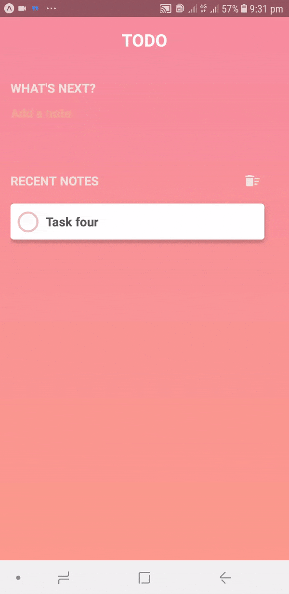

# Cool-React-Native-App
Fork and use as you want. Just my learning process of React Native

  - git clone https://github.com/CodeDruid13/Cool-React-Native-App.git
  - npm install or use yarn
  - Use Expo to preview on phone or local browser
  
  
